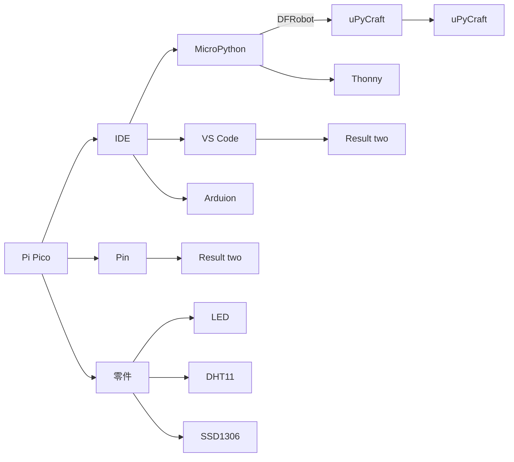

```mermaid
graph LR
A[Pi Pico] -->B[IDE]
    B --> C[MicroPython]
    B --> D[VS Code]
    H --> E[uPyCraft]
    B --> E1[Arduion]
    C --> F[Thonny]
    D --> G[Result two]
    C --> |DFRobot| H[uPyCraft]
A[Pi Pico] -->I[Pin]    
    I --> J[Result two]
A[Pi Pico] -->K[零件]    
    K --> L1[LED]
    K --> L2[DHT11]
    K --> L3[SSD1306]
```

