# 心智圖語法

https://support.typora.io/Math/

https://support.typora.io/Draw-Diagrams-With-Markdown/


---

```flow
st=>start: Start
op=>operation: Your Operation
cond=>condition: Yes or No?
e=>end

st->op->cond
cond(yes)->e
cond(no)->op
```

---

$$
\begin{align*}
y = y(x,t) &= A e^{i\theta} \\
&= A (\cos \theta + i \sin \theta) \\
&= A (\cos(kx - \omega t) + i \sin(kx - \omega t)) \\
&= A\cos(kx - \omega t) + i A\sin(kx - \omega t)  \\
&= A\cos \Big(\frac{2\pi}{\lambda}x - \frac{2\pi v}{\lambda} t \Big) + i A\sin \Big(\frac{2\pi}{\lambda}x - \frac{2\pi v}{\lambda} t \Big)  \\
&= A\cos \frac{2\pi}{\lambda} (x - v t) + i A\sin \frac{2\pi}{\lambda} (x - v t)
\end{align*}
$$


---

$$
\ce{CH4 + 2 $\left( \ce{O2 + 79/21 N2} \right)$}
$$

---

$$
x+1\over\sqrt{1-x^2}\label{ref1}\tag{1}
$$

---
$$
\displaylines{x+y\\y+z}
$$

---
時序圖
```sequence
Alice->Bob: Hello Bob, how are you?
Note right of Bob: Bob thinks
Bob-->Alice: I am good thanks!
```

---

:root {
  --sequence-theme: hand
}


---
流程圖
```flow
st=>start: Start
op=>operation: Your Operation
cond=>condition: Yes or No?
e=>end

st->op->cond
cond(yes)->e
cond(no)->op
```


---


---
時序圖
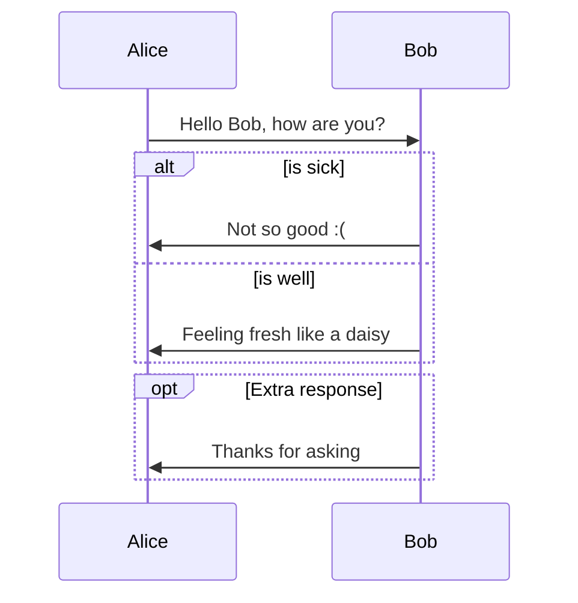
---
流程圖
https://mermaid-js.github.io/mermaid/#/flowchart


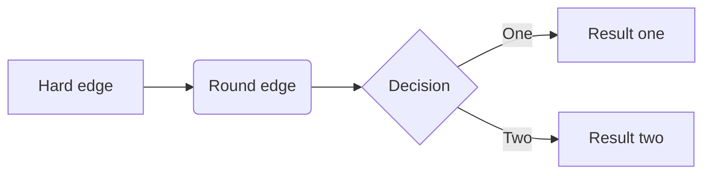

---
===
甘特圖

https://mermaid-js.github.io/mermaid/#/gantt

===

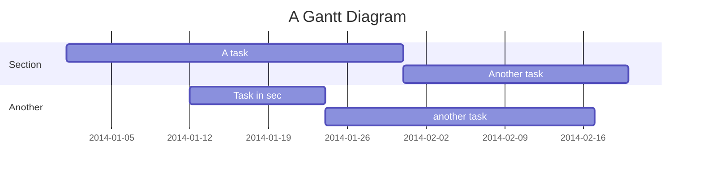

---
===


%% Example with selection of syntaxes
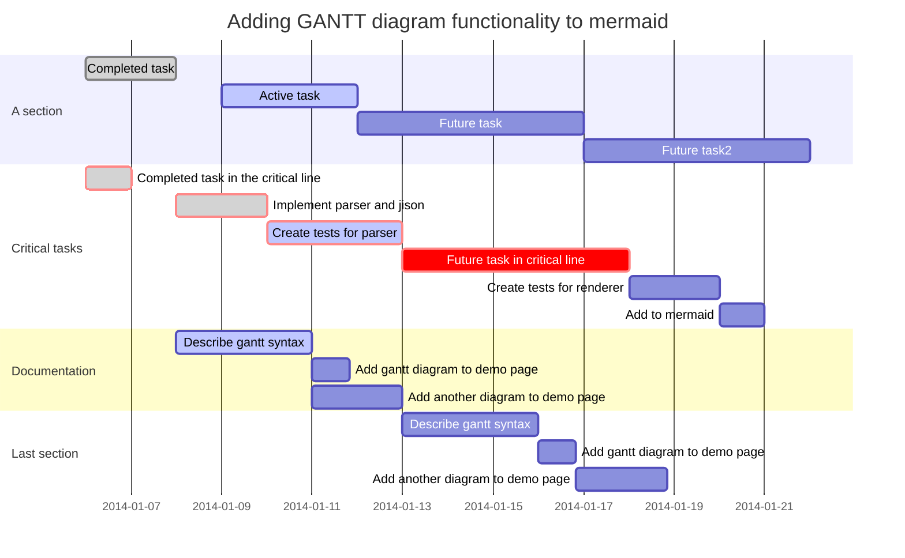


---
類圖

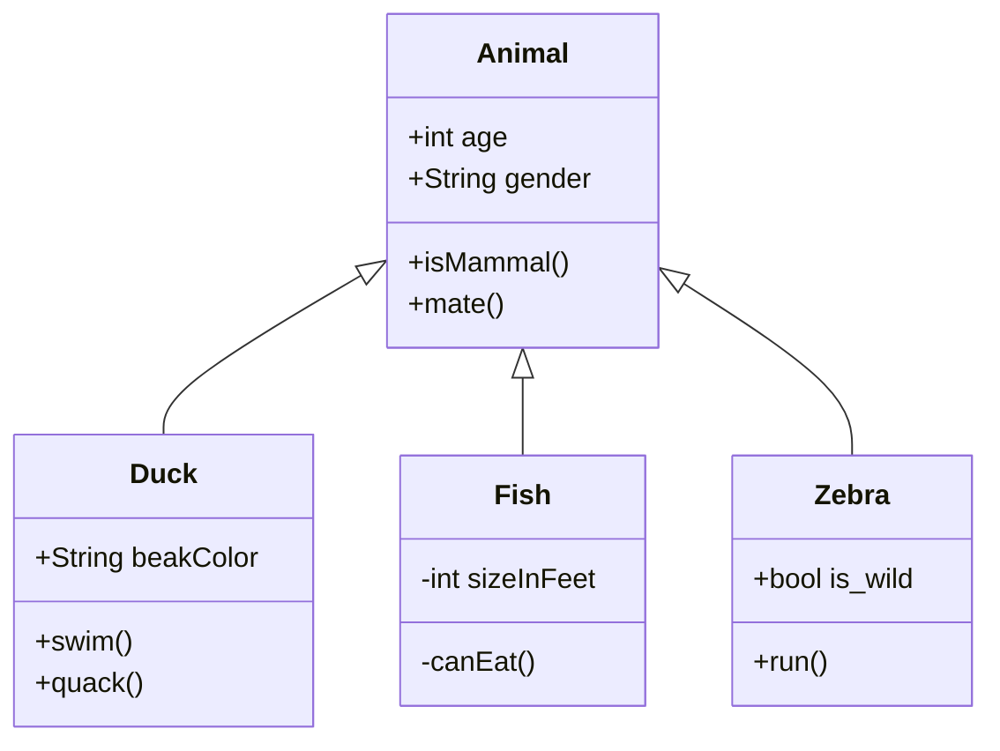
---
狀態圖
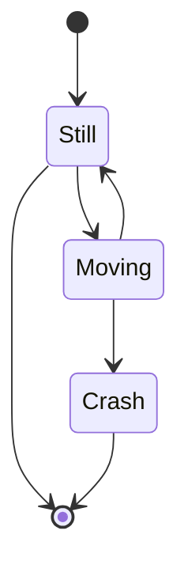
---
餅狀圖
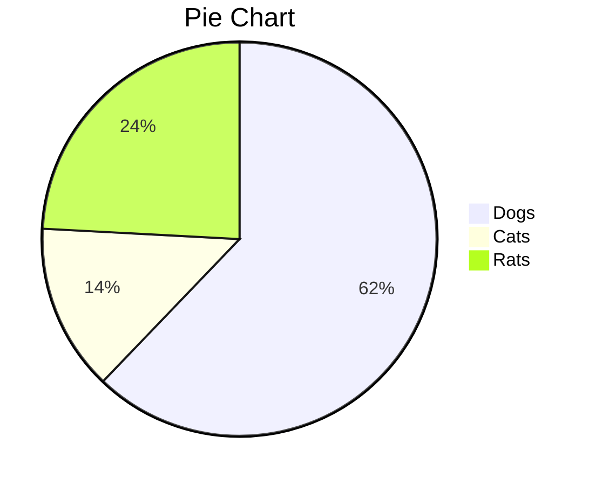

---
需求圖
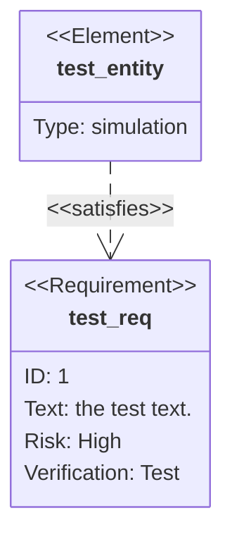

---
Git 圖表
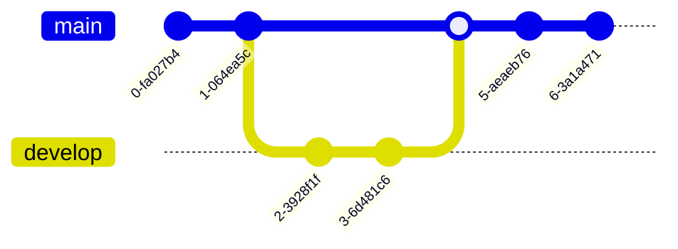

---

:root {
  --mermaid-theme: default; /*or base, dark, forest, neutral, night */
  --mermaid-font-family: "trebuchet ms", verdana, arial, sans-serif;
  --mermaid-sequence-numbers: off; /* or "on", see https://mermaid-js.github.io/mermaid/#/sequenceDiagram?id=sequencenumbers*/
  --mermaid-flowchart-curve: linear /* or "basis", see https://github.com/typora/typora-issues/issues/1632*/;
  --mermaid--gantt-left-padding: 75; /* see https://github.com/typora/typora-issues/issues/1665*/
}

---

```mermaid
:root 
    {--mermaid-theme:dark;}
    
```
---

```mermaid
%%

{init: { **insert argument here**}}

%%
```
---
```mermaid
%%
{
  init: {
    "theme": "dark",
    "fontFamily": "monospace",
    "logLevel": "info",
    "flowchart": {
      "htmlLabels": true,
      "curve": "linear"
    },
    "sequence": {
      "mirrorActors": true
    }
  }
}
%%
```

===


%%{init: { 'logLevel': 'debug', 'theme': 'dark' } }%%
---
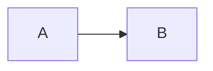

---


%%{init: { "theme": "forest" } }%%
---

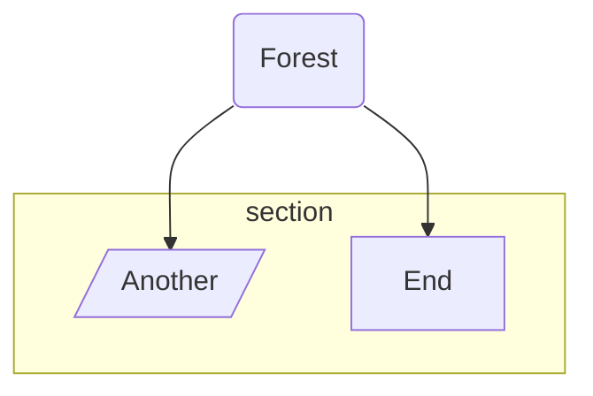

---

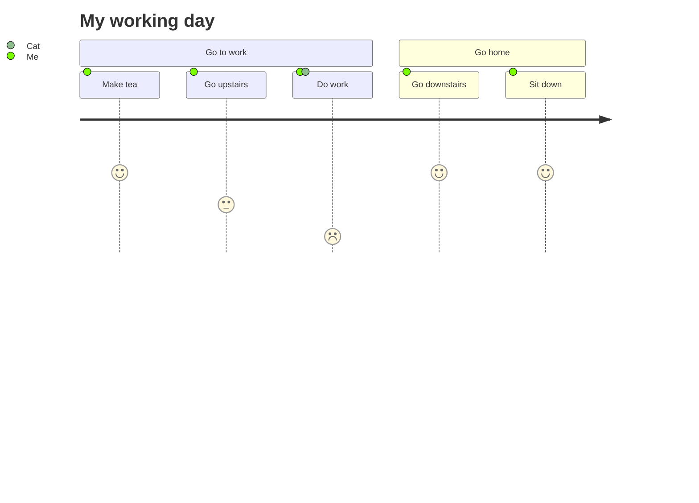
---

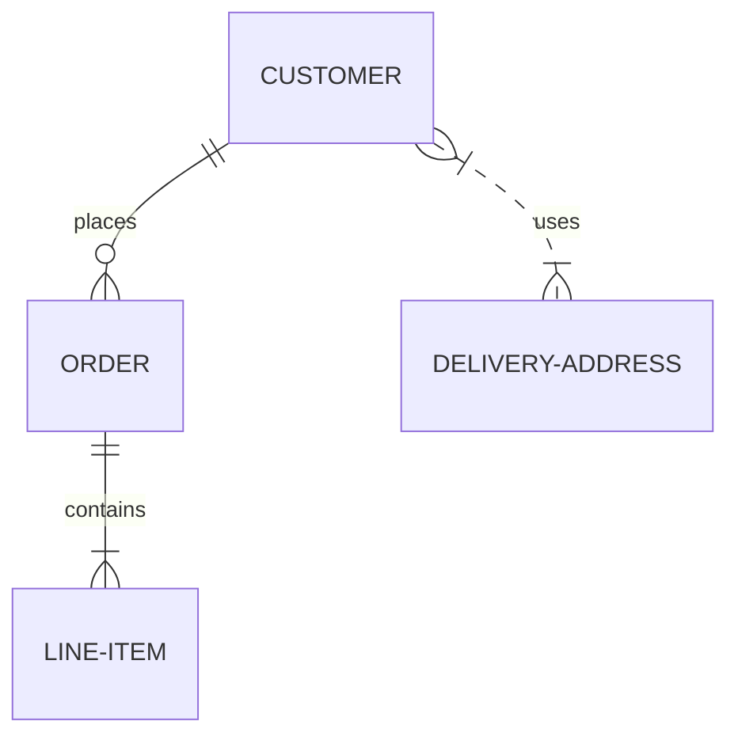

---

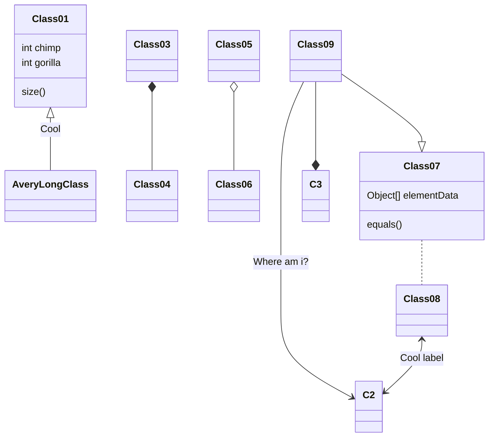

---

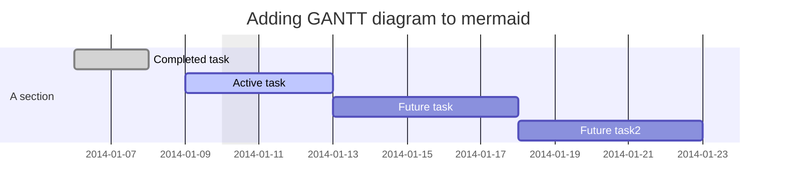

---

https://github.com/mermaid-js/mermaid
https://mermaid-js.github.io/mermaid/#/


